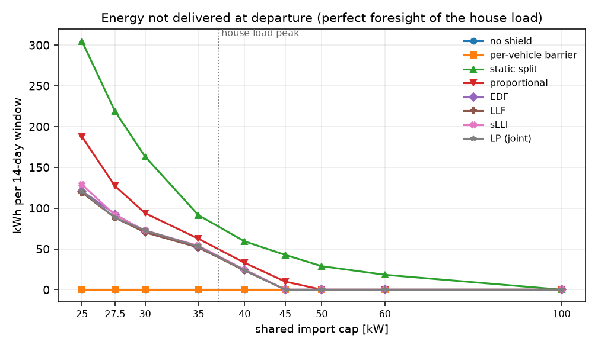
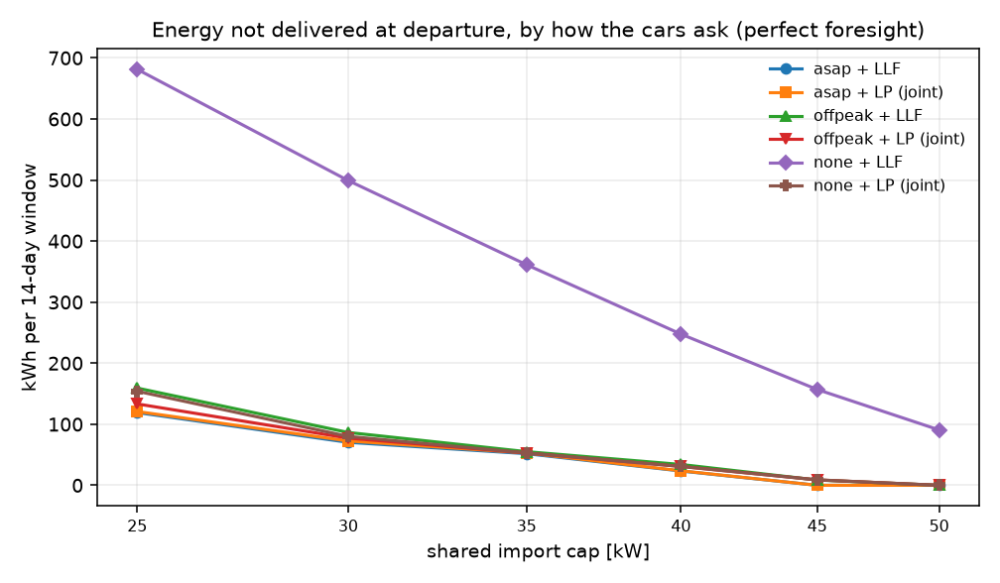
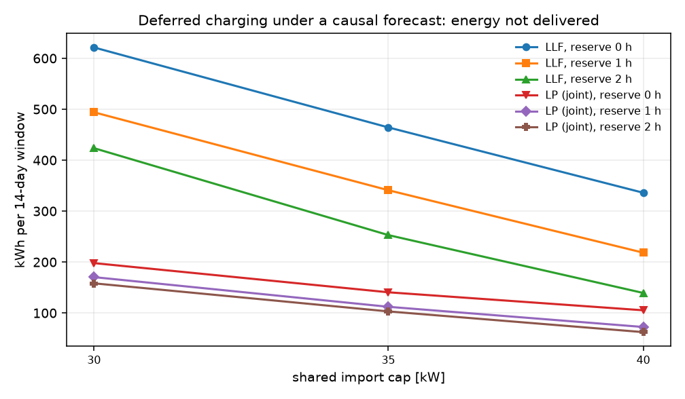
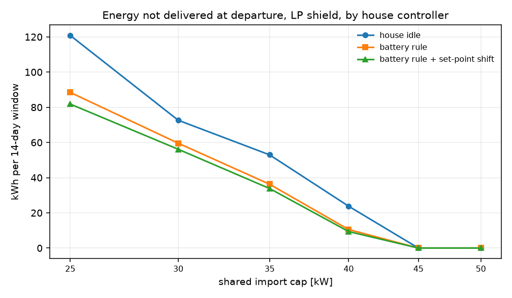

# STEMS on an audited CityLearn: what the simulator, the safety layer, the learner and coordination each contribute

*Report of the work of 3–4 October 2026. Branch `rebuild/audited-pipeline`. Every number here was measured on
real CityLearn 2.6.0b1 with the Travis County building data; vehicle schedules are synthetic (§8). Results in
`RECAP.md` and `stems_report.pdf` predate this work and should be treated as superseded.*

## 1. Summary

1. **The simulator had three defects that invalidated earlier results.** All three come from one change in
   CityLearn 2.4.0 (July 2025). The worst: the indoor-temperature observation never reflected control, so
   every controller, comfort reward and comfort KPI was blind to the heat pump. They are patched, tested, and
   reproduced on plain CityLearn with its own 2023 dataset (§2).
2. **The measurement was wrong in ways that changed conclusions.** Cost was billed at the next hour's price;
   confidence intervals treated seeds as independent replicates. Both are fixed and the KPIs now equal
   CityLearn's own series (§3).
3. **The learner had never learned.** Its entropy temperature was stuck near 1. Rebuilt as a standard
   PPO-Lagrangian, it reaches 0.598 on a known-answer task with optimum 0.6 (the old code: 0.27) (§4).
4. **Comfort needs a stabilising inner loop on this simulator.** Direct power control gave 66–79% discomfort;
   a set-point offset tracked by an integral thermostat gives about 1–5% for every controller (§4).
5. **A barrier that inverts the simulator's own battery equations gives zero state-of-charge violations in all
   eight scenarios, at +0.3–0.5% cost** — against 3.9% with the uniform 0.1 rate of the original
   implementation and 9.1% with Lagrangian pressure alone (§5).
6. **Learning is worth it in some seasons and not others.** A shared PPO policy is 12–41% cheaper than a
   load-following time-of-use rule in spring and summer and 10–25% dearer in winter; pooled over eight
   scenarios the difference is not significant (§5).
7. **EV charging under a shared cap needs a joint shield exactly when charging is deferred** (§6). A
   per-vehicle barrier meets every deadline and imports 78–784 kWh above the cap; dividing the cap between
   houses strands capacity. When cars charge on arrival, earliest-deadline, least-laxity and a joint linear
   programme deliver the same energy to within 3%, and the programme adds only an exact cap and a fair spread
   of unavoidable shortfall. When charging is deferred, the per-vehicle rule leaves 248 kWh undelivered at a
   40 kW cap and the programme 31. Deferral behind it is 21% cheaper at a 50 kW cap; without foresight it
   still misses 14% of departures at 40 kW with a two-hour reserve. A house battery halves the cars'
   shortfall at 40 kW.
8. **The literature search** (§7) produced eighteen ideas, seventeen with code behind them. A residual policy
   on the rule halves the learned policy's winter loss and its summer gain alike (§5).
9. **Full controllers under a binding cap showed two things the shield-level study could not** (§6.7). The cap
   has to cover the house's own battery and hot-water tank, and the shield has to know what its controller
   has decided: 20 kWh above the cap on the test week before, none after; in the grid, 403–503 kWh without
   shields and 3–16 kWh with them. And a learned policy behind a deadline shield stops charging the cars: it
   asks for 0.2–3% of their energy and lets the shield charge them at the last feasible moment. That is
   16–35% cheaper than the rule and misses 9–14 of 67 winter departures where the rule misses 5.

The Consensus plugin was not connected in this session (its connector needs a sign-in), so the literature
search used web sources. Every paper cited was opened and its abstract or text read; the list should be
re-checked through Consensus once it is connected.

## 2. The simulator: three defects, one cause

Up to v2.3.1, `CityLearnEnv.step` advanced the time step and then applied the actions. Since v2.4.0 it
applies the actions first. Code written for the old order was not updated.

| # | Defect | Effect | How it was found |
|---|---|---|---|
| 1 | The `indoor_dry_bulb_temperature` observation is the dataset's uncontrolled value for the next hour | A controller cannot see the effect of its own HVAC action | Constant full cooling in winter: simulated −15 °C, observed 17–23 °C |
| 2 | `dhw_storage` is scaled by `heating_storage.capacity` (0 here) | The hot-water tank action does nothing | Eight steps of charging leave the tank at 0.0 |
| 3 | Each thermal device's ideal load is booked at `t = 0` in `reset()`, then the first step limits the device to nameplate minus that load | Heating asserts whenever the first hour needs more than half the nameplate; storage charging is silently clipped | Every learning run crashed on a sampled building set |

| CityLearn | `step()` order | 1 | 2 | 3 |
|---|---|---|---|---|
| v2.1 – v2.3.1 | advance → apply → update | ok | ok | ok |
| v2.4.0 – v2.4.2 | apply → advance → update | broken | broken | broken |
| v2.5.0, v2.6.0b1 | apply → update → advance | broken | broken | broken |

The 2023 CityLearn Challenge (v2.1) is not affected. Work on ≥ 2.4.0 that feeds the temperature observation to
a controller or reward, or controls `dhw_storage` in a building without a heating tank, is. v2.4–2.5 were
checked by reading the tagged source; 2.6.0b1 is reproduced empirically by
`experiments/citylearn_defects.py`, which uses only CityLearn and its shipped 2023 dataset:
on 144 of 144 controlled building-steps the observation equals the uncontrolled value and never the simulated
one. A draft upstream issue is in `docs/citylearn_v2.4_defects.md` (not filed).

Each patch in `stems/environment.py` announces itself, is recorded in every run's metadata, can be switched
off, and is pinned by tests. Two were proven not to move anything they should not: the first-step patch is
bit-identical on the heat-pump-only path (96,768 values), and the observation patch leaves every other
observation identical on every non-final step.

A further limit of the simulator, not a defect: its temperature model is a learned network that responds
almost statically and very strongly (+0.25 heating raises the indoor temperature 1.5–2.5 °C in an hour;
−0.25 cooling in winter lowers it 4–13 °C, which is not physical). Comfort results depend on that model; one
house's model does not respond to cooling in autumn at all (56% discomfort whatever the controller).

**Consequence for earlier work.** Every comfort number produced before these patches — including the
heat-pump-only benchmark shared with Manal — was computed on a temperature that did not respond to control,
and every hot-water result before the September tank fix drove a dead actuator.

## 3. Measurement

- **Timing.** After a step, CityLearn's observation carries the next hour's price, carbon, solar, set points
  and occupancy, and the simulated hour's consumption and state of charge. KPIs and reward now read the
  conditions of an hour from the observation before the action and its outcomes from the one after.
  Reading both from the latter billed each hour at the next hour's price: on a 72-hour test a battery policy
  timed to the peak lost 88% of its real advantage. Cost, emissions, consumption, peak and discomfort now equal
  values recomputed from CityLearn's own series (cost 682.54 = 682.54, to five digits).
- **Statistics.** A scenario (season × building set) is the unit of replication; seeds are averaged inside it,
  learning arms are paired on matched seeds only, and tests are confined to three pre-declared KPIs
  (violations, cost, discomfort) on named contrasts with a Holm correction. Treating nine seed-runs in three
  scenarios as nine replicates would have given 95% intervals that cover 68–89%.
- **Provenance.** Every run stores a hash of the code that produced it; a resumed grid re-runs anything from
  different code, and aggregation refuses to mix.
- **Scenario bugs.** Sampled building sets had no tariff (cost 0, no economic term in the reward) and a
  different device mix (no hot-water tank). Sets are now drawn from the 39 of 100 houses with the reference
  devices and inherit the tariff and carbon files.

## 4. The controllers

**Learner.** The agent is a PPO-Lagrangian with a shared spatial-temporal encoder. What was wrong and is fixed:
an entropy bonus of weight ~1 that pulled every action to zero (now a fixed 0.01); a reference log-probability
recomputed after the observation normaliser changed, i.e. of a policy that never acted (now recorded when the
action is sampled); window ends treated as terminal (now bootstrapped); a target critic that moved 4% per
episode (now λ-returns); a Lagrangian whose multiplier never exceeded 0.24 (gains re-derived for rate-valued
costs; on a known-answer constraint it takes the violation rate from 0.52 to 0.03). The shield is treated as
part of the environment and the policy is trained on its own sampled action, which is the consistent
estimator (Gros et al. 2020; Markgraf et al. 2025). The first episode only fits the normaliser. One policy is
shared by all buildings: on the winter reference scenario it was 7% under the no-control cost after 30
episodes against 1.5% for per-building actors.

**Heat pump.** The HVAC action is a set-point offset of at most ±1.5 °C, tracked by an integral thermostat
(gain 0.05 per °C per hour, chosen for a loop gain of 0.5 at the measured plant gain of ~10 °C per unit
action). Two "improvements" were tested and rejected because they made comfort worse (integrator reset on
sign conflict: 8.3% mean discomfort; with set-point feed-forward: 13.3%; plain loop: 4.9%). Dixit et al.
(2025) report the same qualitative result on BOPTEST: set-point agents cut discomfort far more than direct
actuation and train in fewer steps.

**Battery barrier.** `stems/battery.py` reproduces CityLearn's battery step per building — efficiency that
depends on power (0.79–0.95), power that depends on state of charge (96–99% of nameplate when empty, 22–29%
when full), 0.16–0.82% standby loss per hour — and inverts it by bisection. It matches the simulator to 1e-4
inside the band and errs toward the protected bound elsewhere. With it the barrier needs no margin and no
buffer and uses the whole band (state of charge rides at 0.101 and 0.899).

**References.** `idle`: thermostat only. `rbc`: charge the battery and tank in the hours before the
16:00–21:00 peak, discharge only as far as the house's own load. The earlier rule (fixed 0.8 discharge,
overnight charging) cost *more* than doing nothing — 515 against 454 over a winter week — because under a
tariff with no export payment it gave most of its discharge away.

## 5. Experiment 1: safety layer and policy

Four seasons × two building sets = 8 scenarios, each trained on one 28-day window and evaluated on the next.
Learning arms: two seeds, 60 episodes, shared policy. 80 runs, no failures.

| Arm | Violations | Cost | Discomfort | Peak kW |
|---|---|---|---|---|
| idle | 1.000 | 1951 | 4.9% | 35.1 |
| idle + calibrated barrier | 0.000 | 1960 | 4.9% | 35.2 |
| rule | 0.300 | 1677 | 4.9% | 45.1 |
| rule + calibrated barrier | 0.000 | 1665 | 4.9% | 45.1 |
| RL (Lagrangian only) | 0.091 | 1666 | 2.2% | 41.4 |
| RL + basic barrier (uniform 0.1 rate) | 0.039 | 1564 | 2.2% | 36.6 |
| RL + calibrated barrier | 0.000 | 1549 | 2.5% | 35.1 |

*Means over the 8 scenarios. Violations: share of building-hours outside the battery's 0.1–0.9 band (the
grid and building caps of this scenario never bind).*

Pre-declared contrasts (difference, 95% interval over scenarios, Holm-corrected p):

| Contrast | KPI | Difference | p (Holm) |
|---|---|---|---|
| RL + calibrated − RL + basic | violations | −0.039 [−0.061, −0.017] | **0.042** |
| rule + calibrated − idle + calibrated | cost | −295 [−347, −243] | **< 0.001** |
| RL + calibrated − idle + calibrated | cost | −411 [−737, −84] | 0.19 |
| RL + calibrated − rule + calibrated | cost | −116 [−462, +230] | 1.0 |
| RL + calibrated − RL | violations | −0.091 [−0.220, +0.037] | 0.84 |

What this supports:

- The calibrated barrier removes violations on every policy in every scenario, and its cost is +0.5% on idle
  and −0.7% on the rule. Calibration matters: the uniform 0.1 rate leaves 3.9% (significant).
- The time-of-use rule saves 15% against no control, in every scenario (10–22%).
- RL is cheaper than the rule in five of eight scenarios and dearer in three:

| Scenario | idle + cal. | rule + cal. | RL + cal. | RL vs rule |
|---|---|---|---|---|
| winter, reference | 2138 | 1794 | 1982 | +10.5% |
| winter, set 1 | 2717 | 2436 | 3039 | +24.8% |
| spring, reference | 1346 | 1048 | 920 | −12.3% |
| spring, set 1 | 1219 | 996 | 810 | −18.7% |
| summer, reference | 1796 | 1521 | 1019 | −33.0% |
| summer, set 1 | 1725 | 1516 | 891 | −41.2% |
| autumn, reference | 2060 | 1663 | 1816 | +9.3% |
| autumn, set 1 | 2678 | 2346 | 1916 | −18.4% |

What it does not support: a general claim that learning beats a good rule. The pooled difference is not
significant, and where the policy wins the reason is mostly mundane. Splitting cost into energy imported and
the average price paid for it:

| Scenario | RL kWh vs rule | Price per kWh, rule / RL | Battery cycles, rule / RL | RL cost vs rule |
|---|---|---|---|---|
| summer, reference | −25% | 0.286 / 0.257 | 9.0 / 20.6 | −33% |
| summer, set 1 | −31% | 0.293 / 0.248 | 7.7 / 20.2 | −41% |
| spring, reference | −16% | 0.257 / 0.269 | 9.6 / 16.6 | −12% |
| spring, set 1 | −20% | 0.259 / 0.263 | 8.6 / 15.5 | −19% |
| autumn, reference | −3% | 0.259 / 0.291 | 13.8 / 11.0 | +9% |
| autumn, set 1 | −24% | 0.259 / 0.279 | 12.7 / 7.9 | −18% |
| winter, reference | −3% | 0.242 / 0.276 | 13.5 / 5.0 | +10% |
| winter, set 1 | +10% | 0.247 / 0.281 | 12.7 / 4.2 | +25% |

- Where the policy wins, it wins by importing 16–31% less energy. In this data the heating and cooling set
  points are equal, so the thermostat regulates to a single target with a 0.3 °C deadband and will cool a
  house that is slightly warm in winter or heat one that is slightly cool on a summer night. A policy that
  moves the target to where the house already is removes that waste. This is the policy compensating a
  limitation of the inner loop, not arbitrage.
- In summer it also pays less per kWh, with twice the rule's battery cycling: that part is learned arbitrage.
- In winter it hardly uses the battery (4–5 cycles against 13), pays more per kWh, and loses.

A fixed "eco" shift of the set point was tried as a no-learning reference and made things worse (+47% cost,
18% discomfort on a three-day winter test), for the same reason: shifting a single target just moves the
fight. The reference that would settle the question is a thermostat with a dead zone. That changes the inner
loop for every arm and means re-running this grid, so it is listed as the next experiment rather than
claimed here.

**A residual policy.** One idea from the literature search (§7) was tested on this question: let the policy
learn a bounded correction on top of the rule (at most ±0.5 of the action range) instead of the whole action.
Winter and summer, both building sets, two seeds, 30 episodes — half the budget of the plain policy above, so
the two columns are not like for like. 16 runs, no failures; the rule's costs reproduce grid 1 exactly.

| Scenario | rule + cal. | residual RL + cal. | vs rule | plain RL vs rule (grid 1) | Battery cycles: rule / residual / plain |
|---|---|---|---|---|---|
| winter, reference | 1794 | 1739 | −3.1% | +10.5% | 13.5 / 17.3 / 5.0 |
| winter, set 1 | 2436 | 2731 | +12.1% | +24.8% | 12.7 / 15.8 / 4.2 |
| summer, reference | 1521 | 1273 | −16.3% | −33.0% | 9.0 / 17.1 / 20.6 |
| summer, set 1 | 1516 | 1258 | −17.0% | −41.2% | 7.7 / 15.5 / 20.2 |

The residual policy keeps the rule's battery cycling, which is what the plain policy fails to learn in
winter, and that halves the winter loss (on the reference set it becomes a 3% gain). It also halves the
summer gain: bounded by ±0.5 around the rule, it cannot move as far from it. State-of-charge violations are
zero in all 8 learned runs. In winter set 1 both learned policies import about 10% more energy than the rule
and are less comfortable (discomfort 9% against 5%); neither is an improvement there. With four
scenarios, two seeds and unequal budgets this is a direction, not a result: starting from the rule bounds the
downside and the upside alike.

## 6. EV charging under a shared cap

The housing-and-EV schema has the eight reference houses, six of them with a charger (7.4 or 11 kW, 1.4 kW
minimum power, efficiency 0.95) and one vehicle each (40–75 kWh). Cars arrive around 17:30 and leave around
07:30 on weekdays; each has a required state of charge at departure. One limit applies to the
neighbourhood's import, Σ_b max(net_b, 0) — the same quantity the grid KPI scores.

### 6.1 What had to be established first

- **The charging plant.** `stems/fleet.py::EVFleetModel` reproduces the simulator's charger and vehicle
  battery: any positive action draws at least 1.4 kW, the battery accepts 96% of nameplate when empty and
  22% when full, and it loses 0.3% of its charge per hour parked. It matches the simulator to 1.3e-4 in state
  of charge over 1,410 connected hours. The previous barrier used nameplate rate × 0.85.
- **What a departure is.** The countdown observation means "this hour and c more". The charge delivered in a
  car's last connected hour never appears in an observation (the next one shows an empty bay), so departures
  are scored from the simulator's own record (`env.ev_departures`).
- **The requirement holds at departure.** A car that is exactly at its requirement with an hour to go leaves
  0.3% below it. A barrier that tests "is it at its requirement now" missed 8 of 67 departures by a hair with
  no cap at all; laxity is therefore defined on the state of charge the car would have when it leaves.
- **An allocation is a draw, not a command.** Granting a nearly full battery its nameplate request wastes
  shared budget it cannot use, and turning a granted draw into a command as if the two were equal leaves each
  car a little short. Every rule is given requests capped at what the car can use this hour, and grants are
  converted with the exact inverse of the plant.

The first version of this study got three of these wrong, and each error changed the conclusion: it showed
the joint programme delivering everything at a 25 kW cap where the rules lost 120–180 kWh. That was an
artefact — the programme's hard winter runs had crashed and the table averaged the easy season, and the rules
were wasting budget. The report script now refuses to produce a table from a stage with failed runs.

### 6.2 The shield

Every hour the shield receives each connected car's state of charge, requirement and remaining hours, what the
controller asks for, and a forecast of each building's load without charging. It returns the charging to
execute.

| Rule | What it does | Source |
|---|---|---|
| no shield | the request, untouched | — |
| per-vehicle barrier | the request, raised to full power once the car's laxity is spent; no view of the cap | the previous design |
| static split | each building may import cap / B | factored shield (ElSayed-Aly et al. 2021) |
| proportional | this hour's cap, every request scaled alike | — |
| EDF | this hour's cap, earliest departure first | Horn (1974) |
| LLF | this hour's cap, least laxity first; ties to the longer remaining charge | Xu, Pan, Tong (2016) |
| sLLF | this hour's cap, rates that equalise next-hour laxity | Chen et al. (2022) |
| LP (joint) | a linear programme over all remaining parking hours | this work; ACN-style MPC (Lee et al. 2021) |

The programme's variables are each car's charging and state of charge in every remaining hour. Its
constraints are the plant (losses and the battery's power taper, which is concave and therefore linear to
impose), the cap in every hour, and the requirement at departure with a non-negative shortfall. It minimises,
in this order: the energy shortfall; the largest share of its requirement any one car misses; the L1 distance
between this hour's charging and what was asked. So when every deadline is reachable it returns the least
change to the request that keeps them reachable, and when the safe set is empty it says so and returns the
least-shortfall allocation, spread rather than dumped on one car. A second pass handles the 1.4 kW minimum
power, which a linear programme cannot express. It also returns the fleet's flexibility interval
(u_min, u_max) and the shadow price of the cap.

The load forecast is either a replay of the same scenario without charging (perfect foresight) or causal:
this hour from the observed non-shiftable load and PV plus the previous hour's controllable remainder, later
hours from the same hour of the previous day, with the cap reduced by the 95th percentile of the last week's
one-hour-ahead errors (an online conformal margin).

### 6.3 Which rule keeps the deadlines (cars charge on arrival)

House devices idle, every car asks for full power while it is below its requirement, two 14-day windows
(winter and summer, 67 departures each), nine caps (seven shown). The house load alone peaks at 42.0 kW in
the winter window and 32.2 kW in the summer one, so a cap of 40 kW and below is under the winter house peak.
252 runs, none failed.

*Energy not delivered at departure [kWh per 14-day window, mean of the two seasons], perfect foresight of
the house load:*

| Shield | 60 kW | 50 kW | 45 kW | 40 kW | 35 kW | 30 kW | 25 kW |
|---|---|---|---|---|---|---|---|
| no shield | 0.1 | 0.1 | 0.1 | 0.1 | 0.1 | 0.1 | 0.1 |
| per-vehicle barrier | 0.0 | 0.0 | 0.0 | 0.0 | 0.0 | 0.0 | 0.0 |
| static split | 18.3 | 28.8 | 42.6 | 59.2 | 91.4 | 163.2 | 304.5 |
| proportional | 0.0 | 0.0 | 9.8 | 33.0 | 62.5 | 93.9 | 187.5 |
| EDF | 0.0 | 0.0 | 0.0 | 24.6 | 51.9 | 70.4 | 121.1 |
| LLF | 0.0 | 0.0 | 0.0 | 23.4 | 51.8 | 70.4 | 119.1 |
| sLLF | 0.0 | 0.0 | 0.0 | 24.5 | 53.8 | 72.6 | 128.7 |
| LP (joint) | 0.0 | 0.0 | 0.0 | 23.8 | 53.0 | 72.6 | 120.8 |

*Energy imported above the cap because of charging [kWh], same runs:*

| Shield | 60 kW | 50 kW | 45 kW | 40 kW | 35 kW | 30 kW | 25 kW |
|---|---|---|---|---|---|---|---|
| no shield | 124.9 | 314.0 | 462.4 | 641.7 | 813.2 | 950.8 | 952.3 |
| per-vehicle barrier | 77.7 | 239.3 | 364.6 | 518.4 | 659.6 | 770.0 | 784.2 |
| static split | 0.0 | 1.8 | 4.6 | 17.1 | 25.4 | 37.6 | 45.5 |
| proportional | 0.0 | 0.0 | 0.0 | 2.5 | 0.8 | 1.3 | 1.4 |
| EDF | 0.0 | 0.0 | 0.0 | 0.1 | 0.0 | 1.0 | 0.1 |
| LLF | 0.0 | 0.0 | 0.0 | 0.1 | 0.0 | 1.0 | 0.1 |
| sLLF | 0.0 | 0.0 | 0.0 | 0.8 | 0.0 | 1.0 | 0.3 |
| LP (joint) | 0.0 | 0.0 | 0.0 | 0.0 | 0.0 | 0.0 | 0.0 |



What this shows:

- **A shield with no view of the cap is not a shield here.** The per-vehicle barrier of the previous design
  meets every deadline and imports 78–784 kWh above the cap doing it.
- **Dividing the cap between houses in advance fails both ways.** The static split strands capacity a
  neighbour is not using: it leaves 18 kWh undelivered at a 60 kW cap, where every rule that shares the cap
  delivers everything, and it still exceeds the cap.
- **When the cars ask on arrival, joint planning buys no extra energy.** EDF, LLF and the linear programme
  deliver the same amount to within 3% at every cap (the programme is 0.4–1.7 kWh behind LLF: its battery
  efficiency is fixed at the worst case, which is conservative). All of the shortfall is in the winter window —
  in summer every cap-aware rule delivers everything down to 25 kW — and the programme reports the safe set
  empty in 4–14% of winter hours at 40 kW and below: that energy does not fit under the cap, whatever the
  rule. This agrees with the scheduling literature (least-laxity rules are near-optimal when capacity is the
  only coupling) and corrects this study's own first result (§6.1).
- **What the programme adds with eager cars is exactness and fairness, not energy.** It is the only rule with
  0.0 kWh above the cap at every cap (the sorting rules exceed it by up to 2 kWh in a winter window, through
  the rounding to the 1.4 kW minimum power that the programme's second pass avoids). And when a shortfall is unavoidable it spreads it: at 40 kW in winter the worst-served car misses
  27% of its requirement under the programme, 49% under LLF and 64% under EDF, which serves fewer cars fully
  (3 missed departures against 5).

With a causal forecast the ranking is the same and everything is a little worse: at 40 kW the cap-aware rules
leave 47–48 kWh undelivered (24 with foresight) and import 12–15 kWh above the cap, because the forecast is
wrong by more than its margin in some hours. The margin calibrates to 5.1 kW in the winter window and 2.5 kW
in the summer one.

### 6.4 How the cars ask decides whether joint planning matters

Same houses, perfect foresight, two shields, three ways of asking: `asap` (as above), `offpeak` (not during the
16:00–21:00 tariff peak), `none` (the car never asks; the shield alone must get it charged, as late as it
dares). 72 runs, none failed.

*Energy not delivered [kWh]:*

| Request + shield | 50 kW | 45 kW | 40 kW | 35 kW | 30 kW | 25 kW |
|---|---|---|---|---|---|---|
| asap + LLF | 0.0 | 0.0 | 23.4 | 51.8 | 70.4 | 119.1 |
| asap + LP | 0.0 | 0.0 | 23.8 | 53.0 | 72.6 | 120.8 |
| offpeak + LLF | 0.0 | 8.7 | 34.1 | 55.1 | 86.6 | 159.3 |
| offpeak + LP | 0.0 | 8.9 | 30.8 | 52.9 | 77.3 | 133.3 |
| none + LLF | 90.7 | 157.0 | 247.6 | 361.4 | 499.2 | 681.4 |
| none + LP | 0.0 | 8.9 | 30.9 | 53.0 | 80.1 | 154.1 |

*Neighbourhood cost and energy drawn by the chargers [kWh] at the 50 kW cap, where every row but one delivers
everything:*

| Request + shield | Cost | Charger energy | Not delivered |
|---|---|---|---|
| asap + LLF | 1780 | 2010 | 0.0 |
| asap + LP | 1845 | 2205 | 0.0 |
| offpeak + LP | 1505 | 2129 | 0.0 |
| none + LP | 1410 | 1727 | 0.0 |
| none + LLF | 1383 | 1601 | 90.7 |



- **Per-vehicle latest-start fails as soon as charging is deferred.** A car that waits until its own last
  feasible hour finds the other cars doing the same, and the cap cannot carry them together: 91 kWh lost at
  50 kW, 248 kWh and 54% of departures at 40 kW. The programme, which computes the *joint* last feasible
  moment, loses 0 and 31 kWh — within 9 kWh of charging on arrival at every cap down to 35 kW. This is the coupled
  feasibility result: each car's deadline is individually reachable and the set of them is not.
- **So the joint shield is what makes cheap charging safe.** Deferral behind it costs 21% less than charging
  on arrival (1410 against 1780 at 50 kW) with nothing undelivered. Below 35 kW it starts to cost energy (80
  against 73 kWh at 30 kW): a shield that waits cannot know which cars will arrive later, and no online rule
  can (Subramanian et al. 2013).
- **Why deferral draws less energy for the same deliveries** (1727 against 2010 kWh). An energy balance on the
  summer window: 80 kWh less standby loss, because a battery filled late spends the night emptier; 10 kWh
  less on board at departure; and the remaining ~190 kWh is conversion loss — CityLearn's battery is less
  efficient at partial power (0.79–0.87 against 0.95), and cars sharing a tight cap in the evening charge at
  partial power. The last term is inferred from the balance, not measured directly, and it is a property of
  this simulator's battery model.
- **Cost is not comparable between the two shields under the same request.** Asked for full power, the
  programme grants it in the hour a car crosses its requirement (the least change to the request), so cars
  leave with 189 kWh above their requirements (summer window); LLF trims each request to what the requirement
  needs (41 kWh above). The 65-unit cost gap between `asap + LLF` and `asap + LP` is that energy, not a scheduling loss.

### 6.5 Without foresight: the price of deferral, and a time reserve

The same comparison with the causal forecast, and with the shield planning every departure 0, 1 or 2 hours
early. 72 runs, none failed.

*Energy not delivered [kWh] / departures missed:*

| Request + shield | Reserve | 40 kW | 35 kW | 30 kW |
|---|---|---|---|---|
| asap + LP | 0 h | 47.5 / 3.7% | 68.2 / 3.7% | 105.6 / 8.2% |
| asap + LP | 2 h | 47.6 / 3.7% | 68.3 / 4.5% | 105.1 / 9.7% |
| none + LLF | 0 h | 336.0 / 57.5% | 464.3 / 67.9% | 621.3 / 76.9% |
| none + LLF | 2 h | 139.3 / 29.1% | 252.9 / 41.0% | 423.6 / 55.2% |
| none + LP | 0 h | 105.3 / 26.1% | 140.6 / 29.1% | 197.9 / 35.8% |
| none + LP | 1 h | 72.5 / 13.4% | 112.2 / 19.4% | 170.4 / 24.6% |
| none + LP | 2 h | 62.4 / 14.2% | 103.1 / 14.2% | 158.2 / 23.1% |



- A shield that defers to the last feasible hour has no room left when its forecast is wrong. With foresight
  the programme lost 31 kWh at 40 kW when the cars never ask; with the causal forecast it loses 105 kWh and
  misses a quarter of the departures.
- Planning two hours early recovers most of that (62 kWh, against 48 for charging on arrival) and keeps most
  of the saving: cost 1412 against 1729. One hour gets 72 kWh.
- The reserve does nothing when the cars ask on arrival, as it should.
- The honest position: **deferred charging under a tight cap is not free without a good forecast.** With a
  two-hour reserve at 40 kW it still misses 14% of departures (by 7 kWh each on average) where charging on
  arrival misses 4%. A learning controller that defers is buying its cost saving partly with this risk, and
  the shield reports it rather than hiding it.

### 6.6 What the house frees up for the cars

Cars charge on arrival, perfect foresight, and the house devices follow no rule, the time-of-use battery rule,
or that rule plus a set-point shift (pre-condition 12:00–16:00, coast 16:00–21:00). 72 runs, none failed.

*Energy not delivered [kWh], LP shield:*

| House controller | 50 kW | 45 kW | 40 kW | 35 kW | 30 kW | 25 kW |
|---|---|---|---|---|---|---|
| idle | 0.0 | 0.0 | 23.8 | 53.0 | 72.6 | 120.8 |
| battery rule | 0.0 | 0.0 | 10.5 | 36.3 | 59.6 | 88.5 |
| battery rule + set-point shift | 0.0 | 0.0 | 9.4 | 33.9 | 56.1 | 81.8 |



- The house battery, discharged over the evening peak, is discharged exactly when the cars arrive: it cuts
  the undelivered energy by 56% at 40 kW and by 18–32% at tighter caps, and the neighbourhood cost by 4–6%.
- The set-point shift takes off another 6–10%. It is small because the houses' thermal response in this simulator is
  nearly static (§2): there is little stored heat to coast on.
- The rule pays for this at midday: charging eight batteries at once raises the house-only peak from 37 to
  44 kW, above the 40 kW cap and every cap under it. In this stage those hours are outside the cars' window
  and are not counted against the charging. §6.7 puts the batteries under the cap as well.

### 6.7 Controllers under a binding cap

The stages above test the shield alone. Running full controllers under a 40 kW cap (the first attempt, a
7-day winter smoke test) exposed two things the shield-level study could not:

| Hour | Import | Cars | House | What happened |
|---|---|---|---|---|
| 21:00, day 1 | 52.7 kW | 30.4 | 22.3 | the rule stopped discharging the batteries; the shield's forecast assumed the house load would persist at 2.3 kW |
| 10:00, day 3 | 43.3 kW | 0.0 | 43.3 | the rule started charging eight batteries and eight hot-water tanks; no car was plugged in, so the fleet shield had nothing to move and predicted 16 kW |

Both are the same omission: the cap was the cars' constraint only, and the shield forecast a load that its
own controller was about to change. Three changes (`stems/fleet.py`, `stems/battery.py`,
`experiments/runner.py`):

1. **The shield knows what the house has already decided.** It runs after the house controller, so the
   battery's and the hot-water tank's actions for this hour are known, and what they draw follows from their
   plant models (`BatteryModel`; a new `TankModel` that matches the simulator's heater to 4e-7 kWh). Only the
   rest of the load is forecast. The worst one-hour forecast error on the test week fell from 26.9 to 8.0 kW
   and the calibrated margin from 9.8 to 3.8 kW.
2. **One cap for everything.** The cars are planned around what the battery and tank discharge; whatever those
   two wanted to *charge* is then cut back, by one common factor found by bisection on the plant models, to
   what the cap leaves once the cars are served. A deadline outranks arbitrage; a recovery charge the
   battery's own band requires is never cut. The barrier's old grid guard is switched off where this shield
   is present (its arithmetic was also wrong — it scaled charging by cap/total, which does not bring the total
   to the cap — and is corrected for the schemas that still use it).
3. **The forecast starts with history.** The controller is built fresh for evaluation; one pass over the
   training window gives the forecaster the days before the evaluation window, as a deployed one would have.

A fourth, optional term forecasts the change the unmodelled remainder made at this hour on previous days
(median of up to seven). It was added before the tank model, turned out to matter little once the tank was
modelled (margin 3.77 against 3.92 kW), and is kept on for the controllers.

The effect on the rule, winter test week at 40 kW: 20.0 kWh above the cap before, 6.4 kWh with the warm-up
alone, 0.0 kWh with all three.

**The grid.** Winter and summer windows of the housing-and-EV schema, 40 kW cap, trained on 14 days and
evaluated on the next 14. Four arms; the learned ones with two seeds and 60 episodes (20,160 steps, the budget
of the residual grid in §5). The shields are the calibrated battery barrier and the cap shield of this section
(joint programme, causal forecast, one-hour reserve). 12 runs, none failed.

*Winter (the house alone peaks at 42 kW):*

| Arm | Cost | Over cap [kWh] | Peak [kW] | Departures missed | EV shortfall [kWh] | Battery outside band | Discomfort | Battery cycles |
|---|---|---|---|---|---|---|---|---|
| rule, cars charge on arrival, no shield | 1892 | 402.8 | 85.3 | 1 / 67 | 0.1 | 29.3% | 2.1% | 7.2 |
| rule + shields | 1778 | 15.8 | 43.1 | 5 / 67 | 55.5 | 0 | 2.1% | 7.0 |
| RL + shields (seeds: 1503, 1490) | 1497 | 17.0 | 45.1 | 14, 9 / 67 | 92.9 | 0 | 2.2% | 4.3 |
| residual RL + shields (1727, 1775) | 1751 | 7.4 | 42.1 | 5, 5 / 67 | 53.3 | 0 | 1.5% | 9.1 |

*Summer (the house alone peaks at 32 kW):*

| Arm | Cost | Over cap [kWh] | Peak [kW] | Departures missed | EV shortfall [kWh] | Battery outside band | Discomfort | Battery cycles |
|---|---|---|---|---|---|---|---|---|
| rule, cars charge on arrival, no shield | 1645 | 502.7 | 72.6 | 1 / 67 | 0.1 | 39.3% | 4.6% | 4.1 |
| rule + shields | 1512 | 3.4 | 41.5 | 0 / 67 | 0.0 | 0 | 4.6% | 4.1 |
| RL + shields (seeds: 1120, 854) | 987 | 0.7 | 40.6 | 0, 0 / 67 | 0.0 | 0 | 0.9% | 5.4 |
| residual RL + shields (1409, 1393) | 1401 | 4.0 | 41.6 | 0, 0 / 67 | 0.0 | 0 | 2.3% | 8.8 |

What each arm asked of the chargers and what was executed, from a replay of the evaluation with the saved
policies:

| Arm | Requested [kWh] | Executed [kWh] | Mean price per kWh charged |
|---|---|---|---|
| rule + shields, winter / summer | 3326 / 3321 | 2107 / 2152 | 0.372 / 0.346 |
| RL + shields, winter (two seeds) | 5, 38 | 1633, 1648 | 0.224, 0.226 |
| RL + shields, summer (two seeds) | 3, 53 | 1737, 1741 | 0.210, 0.210 |
| residual RL + shields, winter (two seeds) | 3047, 3112 | 2131, 2162 | 0.360, 0.369 |

- **The shields do what they are for.** Without them the rule imports 403 and 503 kWh above the cap, peaks at
  85 and 73 kW, and leaves the house batteries outside their band in 29–39% of building-hours. With them:
  16 and 3 kWh, peaks of 43 and 41.5 kW, no band violation — and a bill 6–8% lower, because the cap moves
  310–450 kWh of charging out of the tariff peak. What is left above the cap is the house alone exceeding it
  (5 winter hours) and forecast error beyond the margin.
- **The winter shortfall belongs to the cap, not to the controller.** The rule and the residual policy miss
  the same five cars on the same night, and the shield-level study with perfect foresight also loses five
  departures in this window (§6.3, 47.6 kWh): on that night the energy does not fit under 40 kW.
- **The plain policy does not charge the cars at all.** In all four runs it asks for 0.2–3% of the energy the
  cars receive. The shield does the charging, at the joint last feasible moment, which under this tariff is
  the middle of the night: 0.21–0.23 per kWh against 0.35–0.37 for charging on arrival, and about 20% less
  energy drawn (§6.4). Price times energy puts the cars' share of the bill near 370 for the policy and 745–785
  for the rule. In winter that difference (about 415) is larger than the whole cost gap (281): on the house
  side the policy is dearer than the rule, as in §5, cycling the battery less (4.3 cycles against 7.0). In
  summer it is about 380 of the 525, and the rest is the house-side gain §5 found.
- **And it pays for that in the way §6.5 predicted.** Leaning on a shield that forecasts causally and plans
  one hour early, it misses 14 and 9 of 67 winter departures where the rule misses 5. In the run with
  fourteen: the same five, six cars that leave less than 1% of charge short, and three that leave 2–11%
  short. In summer, where the cap is loose at night, it misses none.
- **The residual policy stays with the rule.** It asks for charging on arrival as the rule does, costs 1.5%
  less in winter and 7% less in summer, misses the same five departures, and has the least energy above the
  cap in winter (7 kWh against 16).

What this means. A deadline shield changes what the learner learns. The cheapest thing the plain policy can
do with the cars is nothing: the shield then charges them as late as it can, and late is cheap. Its saving on
the cars is the shield's schedule, not a learned one. That is a sound way to get cheap charging only if the
shield's last-moment plan is safe, and under a causal forecast it is not quite. Three ways to close the gap,
none run yet: a longer reserve (in §6.5 two hours left 62 kWh undelivered where one hour left 72), a cost on
shield intervention at the charger (the `+pen` arm exists and was not run on this schema), and a reward term
on energy missing at departure. With two scenarios and two seeds the sizes here are not established; the
mechanism is, by direct measurement of what the policy asks for.

## 7. Literature and what was taken from it

Searched with web sources through three parallel searches (EV deadline scheduling; safe multi-agent RL with
coupled constraints; buildings, heat pumps, hot water and EVs). Each entry was opened and read.

| Idea | Source | Status here |
|---|---|---|
| Smoothed least-laxity-first: rates that equalise next-hour laxity | Chen, Kurniawan, Nakahira, Chen, Low (2022), IEEE TSG, arXiv:2102.08610 | rule `sllf`, tested |
| Prioritise less laxity *and* longer remaining charge | Xu, Pan, Tong (2016), IEEE TAC, arXiv:1602.00372 | tie-break of `llf` |
| Always-feasible MPC with a non-completion penalty (Adaptive Charging Network) | Lee et al. (2021), IEEE TSG, arXiv:2012.02636 | the LP shield's degraded mode |
| Exact joint feasibility as a flow problem; EDF can miss deadlines under per-vehicle rate limits | Winschermann et al. (2023), arXiv:2309.06174; Horn (1974) | the LP, extended with battery taper and losses |
| No online rule is feasible on every offline-feasible instance | Subramanian et al. (2013), via Chen et al. (2022) | motivates forecasting and reporting, not hiding, infeasibility |
| Aggregate flexibility interval of a fleet | Mukhi, Loho, Abate (2025), arXiv:2503.23458; Li et al. (2021), arXiv:2012.11261 | `fleet_power_bounds` (u_min, u_max) |
| Factored shield: one sub-constraint per agent | ElSayed-Aly et al. (2021), AAMAS, arXiv:2101.11196 | rule `static`, as the no-communication reference |
| Keep the shield in the environment; train on the raw action | Gros, Zanon, Bemporad (2020), arXiv:2004.00915; Markgraf et al. (2025), arXiv:2509.12833 | the agent's default |
| Make interventions visible to the learner | Krasowski et al. (2023), TMLR, arXiv:2205.06750; Wagener et al. (2021), arXiv:2106.09110 | arm `rl+calibrated+pen` |
| When the safe set is empty: keep the cap hard, relax the deadlines with minimal slack | Wabersich & Zeilinger (2021), arXiv:2105.10241; Zeng et al. (2021), arXiv:2103.12375 | LP objective |
| Fairness when the cap binds | Gardlo et al. (2018), arXiv:1810.01766 | Jain index KPI; min-max tie-break in the LP |
| Residual policy learning | Silver et al. (2018), arXiv:1812.06298 | arm `rl-res+calibrated` |
| Set-point rather than direct actuation | Dixit, Ahmed, Brusey (2025), ACM e-Energy | `hvac_control="setpoint"`; our own measurement agrees |
| Forecast quality in storage MPC | Langtry et al. (2024), arXiv:2402.12539 | perfect vs causal forecast, time reserve |
| Online conformal margin that tracks a coverage target as the data shifts | Gibbs & Candès (2021), arXiv:2106.00170 | the forecast margin is a rolling-window quantile of one-hour-ahead errors; their adaptive update is not implemented |
| A safety filter predicts with the input already decided | Wabersich & Zeilinger (2021), arXiv:2105.10241 | the cap shield computes what the battery and tank will draw from the actions the controller has chosen (§6.7) |
| Flexibility of heat pumps making room for EVs | Edmunds et al. (2021), Applied Energy 298 | house-flexibility stage |
| Shadow price of the cap as a coordination signal | Amaya-Corredor et al. (2026), arXiv:2605.30461; Botkin-Levy et al. (2020), arXiv:2007.10304 | computed by the LP; not yet fed to the policy |

Context the search established:

- EVLearn (Fonseca et al. 2025, arXiv:2404.06521), the EV extension of CityLearn, reports no quantitative
  benchmark in its abstract; the numbers in §6 are, as far as the search found, the first for deadline and
  shared-cap violations on it.
- Khouja et al. (2026, arXiv:2602.19223) find that on CityLearn "DTDE consistently outperforms CTDE in both
  average and worst-case performance" — with no hard district cap. Shojaeighadikolaei et al. (2024,
  arXiv:2404.12520) find a centralised critic helping when EVs share a transformer. Together: coordination pays
  where a constraint couples the agents, which is what §6 measures at the shield level.
- No paper was found that treats a *weekly* Legionella cycle as a deadline constraint in RL. Engelbrecht et
  al. (2021) impose a daily sterilisation as a temperature constraint (median saving falls from 21.9% to
  16.2%); Reyes Premer et al. (2025, arXiv:2510.12955) use a soft penalty. The design in
  `docs/dhw_legionella_design.md` appears to be new.

Not implemented, worth doing next: learning the priority index itself (Nakhleh et al. 2021; Yu, Xu, Tong 2018);
RL choosing the aggregate fleet power with the shield disaggregating (Kwon & Zhu 2022); a battery-degradation
term for V2G (Khezri et al. 2024); a transformer loss-of-life KPI (Panagi et al. 2026).

## 8. What is real, what is synthetic, and the limits

- Buildings, weather, loads, PV: NREL ResStock, Travis County, 2018 (real). Tariff and carbon: the 2022
  challenge's California files. **EV schedules: synthetic** (a seeded commuter model), on real charger and
  battery models.
- One weather year, one 28-day window per season; 8 scenarios. Large effects are resolvable, 1–2% cost
  differences are not.
- The comfort results rest on CityLearn's learned temperature model (§2).
- The grid and building caps of experiment 1 never bind; only the battery band is tested there. The cap binds
  in §6.
- Hot-water "readiness" is no longer reported: in CityLearn the heater serves every draw directly, so an empty
  tank has no consequence. `docs/dhw_legionella_design.md` describes the model that would make it real.
- The EV study is one synthetic fleet (six cars, one arrival pattern) in two 14-day windows. It establishes
  mechanisms — which rule fails, and why — not rates that would transfer to another fleet. Its cost columns
  compare runs that deliver different amounts of energy (§6.4) and should be read with the energy column.
- The linear programme knows the cars that are plugged in, not the ones still to arrive, and fixes the
  battery's efficiency at its worst case. Both make it conservative; neither is tested against an optimum
  computed with hindsight.
- The cap shield cannot hold a cap that the house load alone exceeds: it sheds charging and plans the cars,
  it does not command a battery to discharge. Under the rule, the house alone is above 40 kW in 5 of the 336
  hours of the winter window.
- The forecast margin is an empirical quantile over a rolling week. It tracks its target on these windows; it
  carries no guarantee under a change of regime.
- The controller grid of §6.7 is two scenarios and two seeds. It is reported as measured, without tests.
- `TankModel` covers an electric water heater. A heat-pump water heater (Manal's case) needs the outdoor
  temperature in the model and is refused rather than approximated.

## 9. Reproduction

```bash
.venv/Scripts/python -m pytest tests/ -q
```

```bash
.venv/Scripts/python -m experiments.citylearn_defects
```

```bash
.venv/Scripts/python -m experiments.ablation --seasons winter summer spring autumn --subsets ref 1 --seeds 0 1
```

```bash
.venv/Scripts/python -m experiments.aggregate results/ablation_v1
```

```bash
.venv/Scripts/python -m experiments.ablation --seasons winter summer --subsets ref 1 --seeds 0 1 --episodes 30 --arms idle+calibrated rbc+calibrated rl-res+calibrated --out results/ablation_v2
```

```bash
.venv/Scripts/python -m experiments.ev_coupling --stage rules
```

```bash
.venv/Scripts/python -m experiments.ev_coupling --stage policy --caps 50 45 40 35 30 25
```

```bash
.venv/Scripts/python -m experiments.ev_coupling --stage reserve --caps 40 35 30
```

```bash
.venv/Scripts/python -m experiments.ev_coupling --stage flexibility --caps 50 45 40 35 30 25
```

```bash
.venv/Scripts/python -m experiments.ev_report
```

```bash
.venv/Scripts/python -m experiments.ablation --schema citylearn_schemas/tx_travis_8b_ev/schema.json --grid-cap 40 --seasons winter summer --subsets ref --seeds 0 1 --episodes 60 --days 14 --arms rbc rbc+calibrated rl+calibrated rl-res+calibrated --out results/ev_rl_v1
```

```bash
.venv/Scripts/python -m experiments.ev_rl_report results/ev_rl_v1
```

Every run record carries a hash of `stems/*.py` and `experiments/*.py`. Grid 1: `9708d688ffd6a033`; the
residual grid and the four EV stages: `357fdd2f0e7f61af`; the controller grid of §6.7: `52711521326e4e9a`
(the cap-shield changes; six stored EV-stage runs were replayed on that code and matched on every recorded
number). The hash is over file bytes: the committed tree checks out as `1e4d26ca69fb3a65` here because three
files differ from the grid's copy in line endings and in nothing else.

## 10. Next

1. Hot water with a power-limited heat source and the weekly Legionella cycle as a deadline
   (`docs/dhw_legionella_design.md`), for the meeting with Manal. The deadline machinery of §6 (laxity at
   the deadline, joint feasibility, a reserve) carries over; the tank model needs a heat-pump heater.
2. A thermostat with a dead zone, then grid 1 again: it decides how much of the learned policy's summer gain
   is arbitrage (§5).
3. Close the gap §6.7 found — a learner that leaves the cars to the shield: a two-hour reserve, the
   intervention penalty at the charger, a reward term on energy missing at departure. Then the controller
   grid on more scenarios and seeds, with a hindsight-optimal schedule as the reference.
4. Let the cap shield discharge the batteries when the house alone would exceed the cap, and give the policy
   the shield's two signals (the fleet's flexibility interval and the cap's shadow price) as observations.
5. File the CityLearn issue (`docs/citylearn_v2.4_defects.md`).
6. Re-check the literature list through Consensus once it is connected.
7. Rebuild `RECAP.md` and the LaTeX report from this document.
